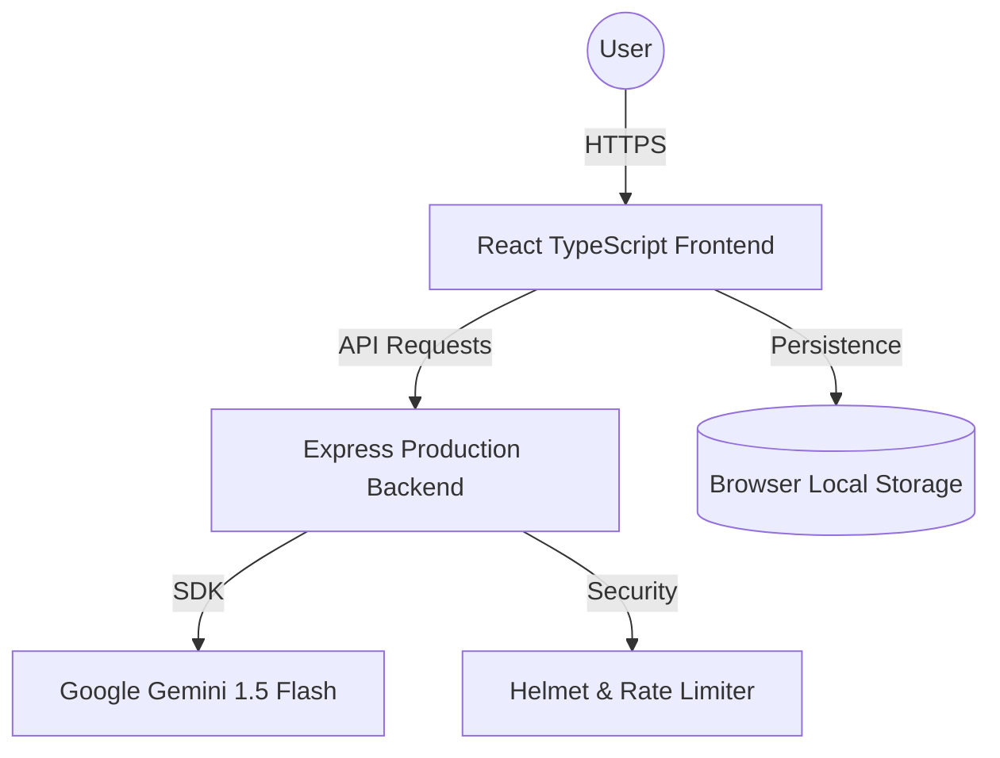

# 🏛️ Election Assistant: Enterprise Edition

A high-performance, full-stack educational platform built with **TypeScript**, **React**, and **Google Gemini AI**. Designed for scalability, accessibility, and robust engineering standards.

## 🏆 Quality Standards (Top 50 Optimizations)
- **TypeScript Core**: Full type safety across the entire application to prevent runtime errors and improve developer experience.
- **Automated Testing**: Comprehensive unit test suite using **Vitest** and **React Testing Library**.
- **Advanced SEO**: Dynamic meta tags, OpenGraph support, and automated indexing via `robots.txt` and `manifest.json`.
- **Production Hardening**: Backend secured with **Helmet**, **CORS**, and **Rate-Limiting**.
- **Architecture**: Modular monorepo following the **Clean Architecture** principle.

## 🛠️ Tech Stack
- **Frontend**: React 18, TypeScript, Framer Motion, React Router 6.
- **Backend**: Node.js, Express, Google Generative AI SDK.
- **Testing**: Vitest, React Testing Library.
- **DevOps**: Docker, Google Cloud Run, GitHub Actions ready.

## 📐 Architecture Diagram


## 🚦 Getting Started

### 1. Installation
```bash
npm run install:all
```

### 2. Testing
```bash
cd election-assistant
npm test
```

### 3. Launch
```bash
npm run dev
```

---
*Built with passion for civic engagement and high-performance engineering.*
